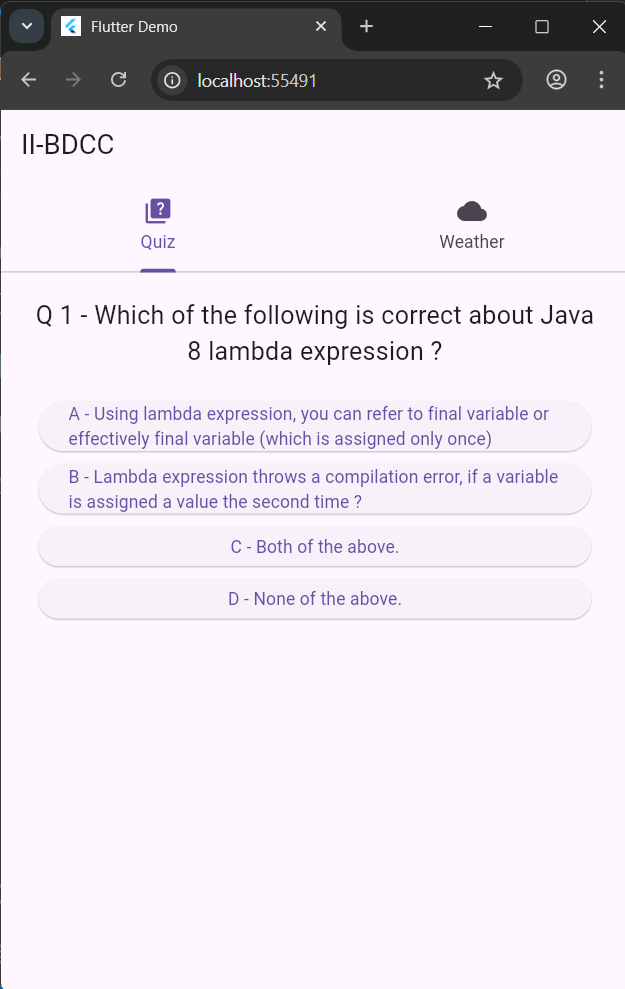
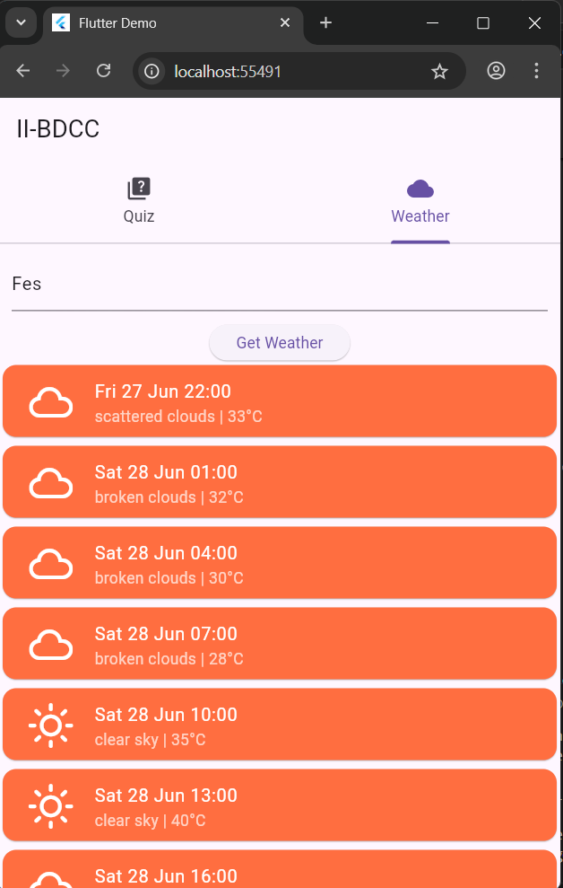

# 📱 DEMO_APP – Flutter Quiz & Weather App

Il s'agit d'une application mobile basée sur Flutter qui combine deux fonctionnalités principales :
- ✅ Une **application quiz** interactive simple pour favoriser l'engagement des utilisateurs.
- 🌦️ Une **application météo** qui récupère des données météorologiques en temps réel à l'aide de l'API OpenWeather.
---

## 📂 Project Structure

```
lib/
├── main.dart
├── answer.dart
├── question.dart
├── quiz.dart
├── score.dart
├── weather.dart
```

---

## 🚀 Features

### 🎯 Quiz Module
- Questions multiples et choix de réponses
- Suivi dynamique des scores
- Commentaires sur les réponses sélectionnées

### ☁️ Weather Module
- Utilise l'API OpenWeatherMap pour récupérer les données météorologiques actuelles
- Affiche la température, la description et les données spécifiques à la ville
- La clé API est chargée de manière sécurisée à partir du fichier .env
---

## 🔑 Environment Variables

Créez un fichier `.env` à la racine avec le format suivant :

```env
OPENWEATHER_API_KEY=your_api_key_here
```

---

## 📦 Dependencies

- flutter_dotenv
- http

Installez-les avec :

```bash
flutter pub get
```

---

## ▶️ Running the App

```bash
flutter run
```

---

## 📸 Screenshots







## 🧠 Author

**Mouad Dacheikh** 